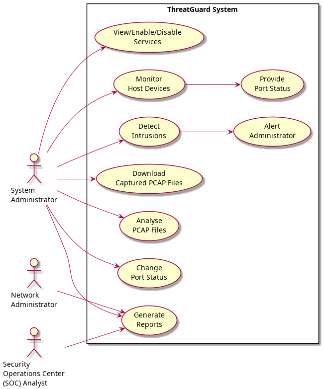
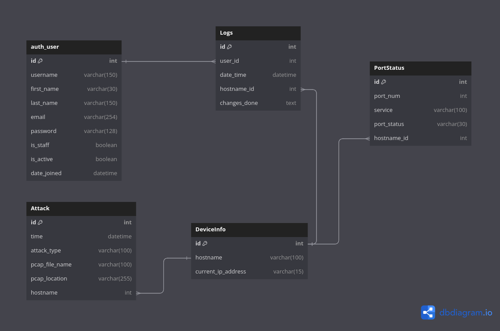

**Software Requirements Specification (SRS)**
---

**1. Introduction**
---

1.1 Purpose
---

The purpose of this document is to specify the requirements for the development of a Host-based Intrusion Detection System (HIDS) using machine learning (ML). This system, named ThreatGuard, aims to enhance network security by monitoring and detecting intrusions on host devices.

1.2 Scope
---

The scope of the project includes the development of a HIDS that can monitor host devices, detect intrusions using ML algorithms, and provide alerts to administrators. The system will also allow administrators to view and administer host devices, including changing port status and managing services.

1.3 Definitions, Acronyms, and Abbreviations
---

- HIDS: Host-based Intrusion Detection System
- ML: Machine Learning
- SOC: Security Operations Center

1.4 References
---

- KDDCUP99 dataset: http://kdd.ics.uci.edu/databases/kddcup99/kddcup99.html

**2. Overall Description**
---

2.1 Product Perspective
---

ThreatGuard will operate as a standalone system, interacting with host devices to monitor and detect intrusions. It will also provide a web interface for administrators to view and administer host devices.

2.2 Product Features
---

- Monitor Host Devices: ThreatGuard will monitor host devices for suspicious activity and potential intrusions.
- Detect Intrusions: The system will use ML algorithms to detect intrusions based on network traffic patterns.
- Alert Administrator: ThreatGuard will provide alerts to administrators when intrusions are detected.
- View and Administer Host Devices: Administrators will be able to view and administer host devices, including changing port status and managing services.

2.3 User Classes and Characteristics
---

- System Administrator: Responsible for managing and configuring ThreatGuard.
- Network Administrator: Responsible for network operations and security.
- SOC Analyst: Responsible for monitoring and analyzing security incidents.

2.4 Operating Environment
---

ThreatGuard will be developed using Django for the backend and HTML, CSS, and JavaScript for the frontend. It will be deployed on a server running Python and SQLite3 for the database.

**3. Specific Requirements**
---

3.1 Functional Requirements
---

3.1.1 Monitor Host Devices
- The system shall monitor network traffic on host devices.
- The system shall analyze network traffic patterns for suspicious activity.

3.1.2 Detect Intrusions
- The system shall use ML algorithms to detect intrusions.
- The system shall classify detected intrusions based on severity.

3.1.3 Alert Administrator
- The system shall provide alerts to administrators when intrusions are detected.
- The system shall send alerts via email.

3.1.4 View and Administer Host Devices
- Administrators shall be able to view a list of host devices.
- Administrators shall be able to change the status of ports on host devices.
- Administrators shall be able to view and manage services running on host devices.

3.2 Non-Functional Requirements
---

3.2.1 Security
- The system shall require authentication for access.
- The system shall encrypt sensitive data.

3.2.2 Performance
- The system shall be able to process network traffic in real-time.
- The system shall be able to handle a large number of host devices.

3.2.3 Usability
- The system shall have a user-friendly interface.
- The system shall provide clear and informative alerts.

**4. Appendix**
---

4.1 Use Case Diagram
---

```


```

4.2 Entity Relationship Diagram
---

```


```

4.3 Glossary
---

- IDS: Intrusion Detection System
- RFC: Random Forest Classifier

This concludes the Software Requirements Specification for ThreatGuard.
